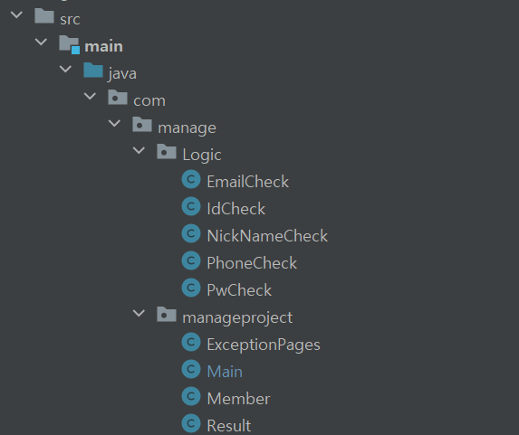

# 회원가입

---

- `아이디`, `패스워드`, `이메일`, `닉네임`, `전화번호`를 입력받는다.
- 전달받은 값들을 각각의 로직에 대입하여 결과를 요청받는다.

### 가입 관련 로직
> Main 클래스의 체크 관련 로직에 대한 클래스를 구현할 것!
> 모든 로직은 개발자 본인이 할 수 있는 만큼 구현해볼 것!  
> 최소 1개 이상, 밑에 나온 예제들 말고 본인이 구현하고 싶은게 있다면 구현해도 무관

 

#### 1. 아이디 체크   
    1. 중복 확인
        - Member 클래스의 id 값을 반복문을 통해서 조회한다.
        - 조건문을 통해 중복된 값이 존재하면, `ServletException` 예외를 날려준다.
    2. 길이 설정
        - 5자 ~ 12자 사이로 작성되도록 할 것
    3. 특수 문자 불가능

 

#### 2. 비밀번호 체크
    1. 길이 설정
        -  5 ~ 20자 이내로 작성되도록 할 것
    2. 숫자, 소문자, 대문자, 특수 문자 체크
        - 위 4개중 3개 이상 입력되었는지 체크

 

#### 3. 핸드폰 번호 체크
    1. 핸드폰 번호 유효성 검사하기
        - 핸드폰 번호 정규식으로 검증 로직 작성하기
        - 형식이 일치하지 않으면 IllegalArgumentException 발생시키기

#### 4. 이메일 체크
    1. 중복 체크
        - Member 클래스의 email 값을 반복문을 통해서 조회한다.
        - 조건문을 통해 중복된 값이 존재하면, `ServletException` 예외를 날려준다.

#### 5. 닉네임 체크
    1. 중복 체크
        - Member 클래스의 nickname 값을 반복문을 통해서 조회한다.
        - 조건문을 통해 중복된 값이 존재하면, `ServletException` 예외를 날려준다.
    
    2. 길이 체크
        - 3 ~ 10자 이내로 되게 할 것

---

### 패키지 구조

